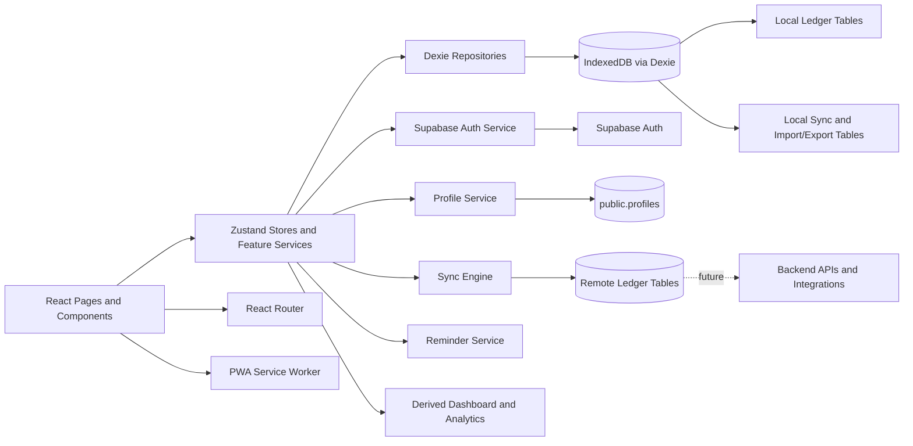

# Component Diagram

*Monilog - Offline-First Web Component View*

## Purpose

This document describes the active components in the Monilog web application and the future components the architecture reserves space for.

## Current Component Groups

- presentation components
- route and provider components
- local data components
- auth and backend foundation components
- browser service components
- sync and integration components

## Active Components

| Component | Responsibility |
| --- | --- |
| React Pages and Layouts | Auth, onboarding, dashboard, transactions, analytics, settings, import, and export views |
| Shared UI Components | Reusable cards, inputs, dialogs, charts, layouts, and display widgets |
| React Router | Route definitions and guarded navigation |
| Zustand Stores | Expose app-facing state and coordinate workflow actions |
| Dexie Database | Local persistence entry point for ledger data and sync metadata |
| Dexie Repositories | Query and write focused slices of local data |
| Database Bootstrap Layer | Initialize defaults and seed the local workspace safely |
| Sync Engine | Push pending changes, pull remote changes, and reconcile local state |
| Supabase Client | Connect to Supabase using environment-based configuration |
| Supabase Auth Service | Manage email auth, session restore, sign-out, and future OAuth or OTP extension points |
| Profile Service | Manage the app-level `public.profiles` row |
| PWA Service Worker | Cache the app shell and static assets for offline loading |
| Reminder Service | Coordinate browser notification permission and reminder prompts |

## Additional Components

| Component | Planned Responsibility |
| --- | --- |
| Backend APIs / Integrations | Chatbot, webhooks, future automation, and server-side processing |
| Edge Functions or Workers | Later server-side workflows where client-only behavior becomes insufficient |

## Data Components

### Active Local Business Tables

- accounts
- categories
- transactions
- transfers
- settings
- notification preferences

### Active Remote Identity/Profile Tables

- `auth.users`
- `public.profiles`

### Active Remote Ledger Tables

- `accounts`
- `categories`
- `transactions`
- `transfers`
- `settings`
- `notification_preferences`

### Local-Only Tables

- import records
- export records
- sync operations

### Derived Components

- dashboard summary builders
- analytics summary builders
- account balance derivation

## Key Interaction Flows

### Authentication and Profile Provisioning

1. User signs in or signs up with email/password, while phone and Google remain visible as upcoming options.
2. Auth services call Supabase Auth.
3. Session state updates reactively.
4. The profile service loads or upserts `public.profiles`.
5. Router sends the user to profile completion, onboarding, or dashboard.

### Manual Transaction Entry

1. User submits a transaction in the web UI.
2. Form validation prepares the payload.
3. Dexie repository writes the record to IndexedDB.
4. Sync engine records the local mutation for later upload.
5. Zustand selectors and local queries update the visible state.
6. Dashboard and analytics recompute from persisted source records.

### Manual Transfer Entry

1. User opens transfer flow from dashboard or transactions area.
2. Form validation checks account selection, amount, fee, and source balance.
3. Dexie repository writes the transfer row to IndexedDB.
4. Sync engine records the local mutation for later upload.
5. Account balances recompute locally from transactions plus transfers.
6. History and analytics refresh with transfer-safe semantics.

### Onboarding and Settings

1. User updates currency, balances, or reminders.
2. Stores and services write to Dexie-backed settings and accounts data.
3. Profile metadata may be mirrored to `public.profiles`.
4. Reminder side effects are coordinated separately where needed.

### Import and Export

1. User chooses a local CSV import or export action.
2. The import/export services coordinate parsing, validation, mapping, and persistence.
3. Import/export history is stored locally without becoming syncable business data.

## Mermaid Component Diagram

## Summary

The component architecture preserves the same Monilog product flow while changing the client platform to the browser. React renders the experience, Dexie holds the local truth, the sync engine bridges to Supabase, and the PWA shell keeps the app usable when the network is unreliable.
