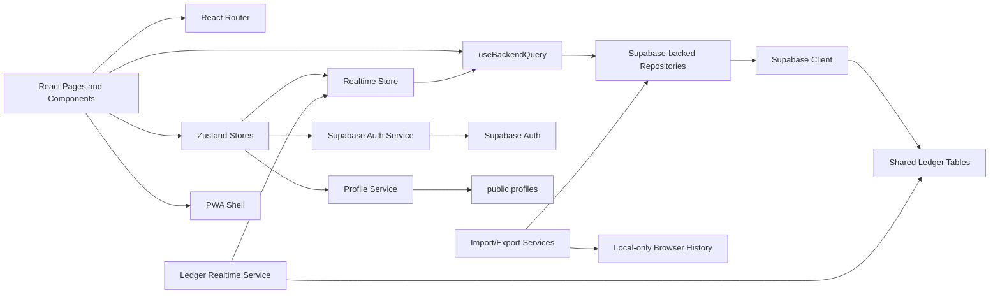

# Component Diagram

*Finance Ledger - Direct Supabase Web Component View*

## Purpose

This document describes the active web components after removing the sync layer.

## Active Component Groups

- React presentation components
- route and provider components
- Supabase-backed repository components
- auth/profile services
- realtime subscription and status components
- browser-only operational services

## Components

| Component | Responsibility |
| --- | --- |
| React Pages and Layouts | Auth, onboarding, dashboard, transactions, transfers, analytics, settings, import, and export views |
| Shared UI Components | Cards, inputs, dialogs, tables, charts, empty states, and backend status displays |
| React Router | Route definitions and guarded navigation |
| Auth Store | Session, user, profile, profile refresh, sign-in, sign-up, sign-out |
| Realtime Store | Connection status, backend event revision, last event metadata |
| Repository Modules | Supabase CRUD and derived query boundaries |
| Supabase Client | Browser client for Auth, PostgREST, and Realtime |
| Supabase Auth Service | Email auth, session restore, sign-out |
| Profile Service | `public.profiles` ensure/read/update |
| Ledger Realtime Service | One scoped channel per signed-in user |
| Audit Repository | Local-only import/export history |
| Import/Export Services | CSV parse, validation, mapping, commit, and browser download |
| PWA Shell | Static shell caching and installability |
| Reminder Hooks | Browser permission and device-specific notification capability |

## Data Components

### Shared Supabase Tables

- `profiles`
- `accounts`
- `categories`
- `transactions`
- `transfers`
- `settings`
- `notification_preferences`

### Local-Only Browser Data

- import history
- export history
- transient import mapping state
- browser notification permission state
- UI filters and view state

### Derived Components

- dashboard summary
- account balance snapshots
- ledger history projection
- analytics snapshots

## Key Interaction Flows

### Authentication and Backend Bootstrap

1. User signs in with Supabase Auth.
2. Auth store hydrates session and user.
3. Profile service ensures `public.profiles`.
4. Workspace repository seeds settings, default accounts, and user-owned default categories in Supabase when missing.
5. Realtime service subscribes to the active user's backend rows.

### Manual Transaction Entry

1. User submits a transaction form.
2. Form validation prepares the payload.
3. Transaction repository inserts the row directly in Supabase.
4. Repository marks a local realtime revision for immediate UI refresh.
5. Supabase Realtime also broadcasts the backend change.
6. Dashboard, history, and analytics queries refetch.

### Transfer Entry

1. User chooses source/destination accounts and amount.
2. Transfer repository validates source balance from backend-derived balances.
3. Transfer is inserted in Supabase.
4. History and balance views refresh through realtime invalidation.

### Import

1. User selects a CSV file.
2. Import service parses and validates in memory.
3. User confirms mappings.
4. Created accounts/categories/transactions are written to Supabase.
5. Import history is stored locally on the device.

### Export

1. Export service reads active backend transactions.
2. Browser downloads CSV.
3. Export history is stored locally on the device.

## Mermaid Component Diagram

## Removed Components

- Dexie database
- sync engine
- sync outbox repository
- sync status store
- sync status banner
- local business-data source tables

## Summary

React renders the product, repositories talk directly to Supabase, realtime invalidates backend queries, and browser storage is limited to local-only operational history.
