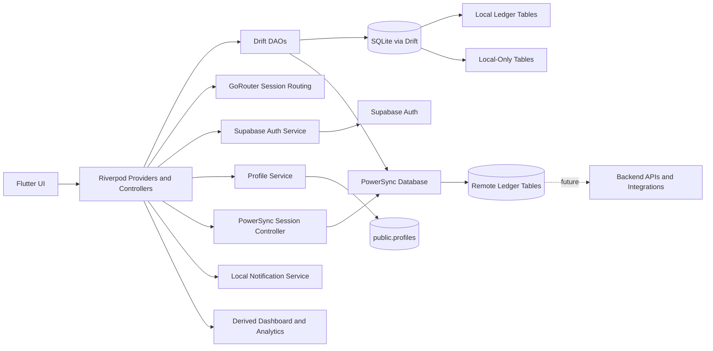

# Component Diagram

*Finance Ledger - Local-First Component View with PowerSync and Supabase*

## Purpose

This document describes the active components in the current mobile app and the future components the architecture is reserving space for.

## Current Component Groups

- presentation components
- application state components
- local data components
- auth/backend foundation components
- device service components
- sync and integration components

## Diagram Images

The historical component images remain in `docs/images/`, but the textual view below is the current architectural source of truth for the mobile application phase.

## Active Components

| Component | Responsibility |
| --- | --- |
| Flutter UI Screens | Auth, onboarding, dashboard, transactions, analytics, settings, import/export flows |
| Shared UI Components | Reusable cards, inputs, layouts, and display widgets |
| Riverpod Providers | Expose app state to the UI |
| Riverpod Notifiers / Controllers | Handle mutations and workflow orchestration |
| GoRouter Session Routing | Direct users into signed-out, profile-completion, onboarding, or main-app flows |
| Drift Database | Local persistence entry point for ledger data |
| Drift DAOs | Query and write focused slices of local data |
| Database Bootstrap Layer | Initialize defaults, claim local ownership, and reset local data safely |
| PowerSync Database | Open the SQLite file with sync support and maintain the local upload queue |
| PowerSync Session Controller | Connect and disconnect sync based on authenticated Supabase state |
| Supabase Client | Connect to Supabase using environment-based configuration |
| Supabase Auth Service | Manage active email auth, session restore, sign-out, and future OAuth / OTP extension points |
| Profile Service | Manage the app-level `public.profiles` row |
| Local Notification Service | Schedule and cancel device reminders |

## Additional Components

| Component | Planned Responsibility |
| --- | --- |
| Remote Ledger Tables | Persist synced accounts, categories, transactions, settings, and notification preferences |
| Backend API / Integrations | Chatbot, webhooks, future automation, and server-side processing |

## Data Components

### Active Local Business Tables

- accounts
- categories
- transactions
- settings
- notification preferences

### Active Remote Identity/Profile Tables

- `auth.users`
- `public.profiles`

### Active Remote Ledger Tables

- `accounts`
- `categories`
- `transactions`
- `settings`
- `notification_preferences`

### Local-Only Tables

- import records
- export records

### Derived Components

- dashboard summary builders
- analytics summary builders
- account balance derivation

## Key Interaction Flows

### Authentication and Profile Provisioning

1. User signs in or signs up with email/password, while phone and Google remain visible as upcoming UI options.
2. Riverpod auth controllers call Supabase Auth.
3. Session state updates reactively.
4. The profile service loads or upserts `public.profiles`.
5. PowerSync connects when configured and the session is authenticated.
6. Router sends the user to profile completion, onboarding, or dashboard.

### Manual Transaction Entry

1. User submits a transaction in Flutter UI.
2. Riverpod controller validates and prepares the payload.
3. Drift DAO writes the record to SQLite.
4. PowerSync records the local mutation for later upload.
5. Drift watch streams update provider state.
6. Dashboard and analytics recompute from persisted source records.

### Onboarding and Settings

1. User updates currency, balances, or reminders.
2. Riverpod writes to Drift-backed settings/accounts data.
3. Profile metadata may be mirrored to Supabase `public.profiles`.
4. Notification side effects are coordinated separately where needed.

### Import and Export

1. User chooses a local CSV import or export action.
2. Riverpod coordinates parsing, validation, mapping, and persistence.
3. Import/export history is stored locally without becoming syncable business data.

## Mermaid Component Diagram

## Summary

The current component architecture now has both a real remote identity layer and a real sync foundation. The ledger remains local-first in runtime behavior, while PowerSync and Supabase now provide the active path toward authenticated multi-device continuity.
