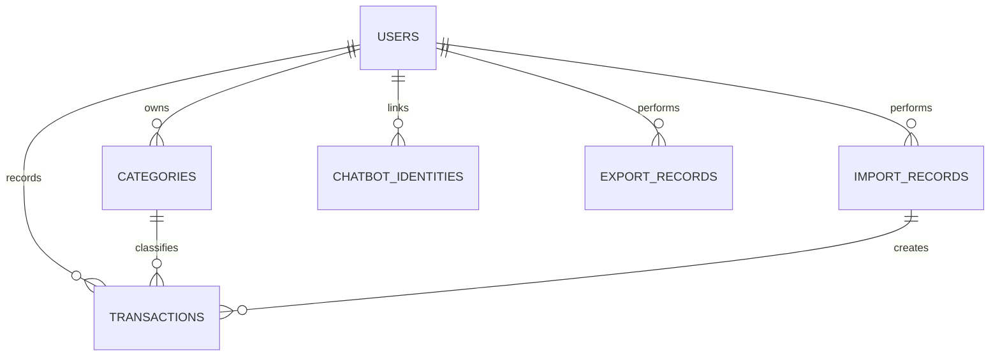

# Entity Relationship Diagram (ERD)

*Finance Ledger - Smart Financial Tracking & Analytics Tool*

## Purpose

This document describes the major data entities in Finance Ledger and the relationships between them.

## ER Diagram

## Core Entities

| Entity | Description |
| --- | --- |
| User | Registered account owner |
| Category | User-owned transaction classification |
| Transaction | Income or expense record |
| ImportRecord | Batch import operation |
| ChatbotIdentity | Mapping between a user and an external messaging identity |
| ExportRecord | Export operation performed by a user |

## Key Attributes by Entity

### User

- `id`
- `name`
- `email`
- `phone_number`
- `password_hash`
- `created_at`
- `updated_at`

### Category

- `id`
- `user_id`
- `name`
- `type`
- `is_default`
- `created_at`

### Transaction

- `id`
- `user_id`
- `category_id`
- `amount`
- `type`
- `account`
- `description`
- `transaction_date`
- `source`
- `raw_input`
- `import_record_id`
- `created_at`
- `updated_at`

### ImportRecord

- `id`
- `user_id`
- `file_name`
- `format`
- `total_records`
- `successful_records`
- `failed_records`
- `status`
- `error_summary`
- `created_at`

### ChatbotIdentity

- `id`
- `user_id`
- `platform`
- `external_id`
- `phone_number`
- `is_active`
- `linked_at`

### ExportRecord

- `id`
- `user_id`
- `format`
- `filters_applied`
- `record_count`
- `created_at`

## Relationship Summary

- A user can own many categories.
- A user can own many transactions.
- A category can classify many transactions.
- A user can perform many import records.
- An import record can create many transactions.
- A user can have many chatbot identities.
- A user can perform many export records.

## Mermaid ER Diagram

## Design Notes

- `Transaction` is the operational core entity.
- `Category` is user-owned to support customization.
- `ImportRecord` and `ExportRecord` provide traceability for data movement.
- `ChatbotIdentity` prepares the platform for WhatsApp now and additional chat channels later.
- Analytics are derived from transaction data and are not modeled as a primary persistent entity in the ERD.
