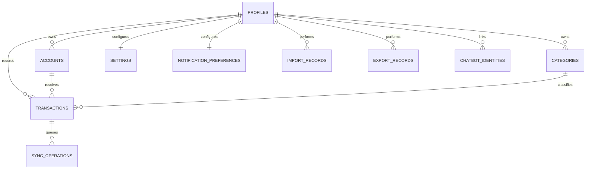

# Entity Relationship Diagram (ERD)

*Finance Ledger - Smart Financial Tracking & Analytics Tool*

## Purpose

This document describes the major data entities in Finance Ledger and the relationships between them for the web-based, offline-first product direction.

## ER Diagram

## Core Entities

| Entity | Description |
| --- | --- |
| Profile | App-level user profile linked to Supabase Auth |
| Account | User-owned money container with an opening balance |
| Category | User-owned or system-defined transaction classification |
| Transaction | Income or expense record |
| Settings | User preference and onboarding state record |
| NotificationPreference | Reminder preference record |
| ImportRecord | Batch import operation |
| ExportRecord | Export operation performed by a user |
| SyncOperation | Local outbox and sync failure tracking record |
| ChatbotIdentity | Mapping between a user and an external messaging identity for future chatbot flows |

## Key Attributes by Entity

### Profile

- `id`
- `name`
- `email`
- `phone_number`
- `avatar_url`
- `onboarding_completed`
- `preferred_currency`
- `created_at`
- `updated_at`

### Account

- `id`
- `remote_id`
- `user_id`
- `name`
- `type`
- `initial_balance`
- `currency_code`
- `is_default`
- `display_order`
- `sync_status`
- `created_at`
- `updated_at`
- `deleted_at`

### Category

- `id`
- `remote_id`
- `user_id`
- `name`
- `type`
- `icon_key`
- `color_key`
- `is_system`
- `is_active`
- `sync_status`
- `created_at`
- `updated_at`
- `deleted_at`

### Transaction

- `id`
- `remote_id`
- `user_id`
- `account_id`
- `category_id`
- `amount`
- `type`
- `note`
- `reference`
- `transaction_date`
- `sync_status`
- `created_at`
- `updated_at`
- `deleted_at`

### Settings

- `id`
- `remote_id`
- `user_id`
- `currency_code`
- `theme_mode`
- `onboarding_complete`
- `sync_status`
- `created_at`
- `updated_at`

### NotificationPreference

- `id`
- `remote_id`
- `user_id`
- `enabled`
- `reminder_time`
- `timing_mode`
- `sync_status`
- `created_at`
- `updated_at`

### ImportRecord

- `id`
- `file_name`
- `format`
- `total_records`
- `successful_records`
- `failed_records`
- `status`
- `error_summary`
- `created_at`

### ExportRecord

- `id`
- `format`
- `filters_applied`
- `record_count`
- `file_name`
- `created_at`

### SyncOperation

- `id`
- `entity_name`
- `entity_id`
- `operation`
- `status`
- `retry_count`
- `error_message`
- `created_at`
- `updated_at`

### ChatbotIdentity

- `id`
- `user_id`
- `platform`
- `external_id`
- `phone_number`
- `is_active`
- `linked_at`

## Relationship Summary

- A profile can own many accounts.
- A profile can own many categories.
- A profile can own many transactions.
- A profile can own one primary settings record.
- A profile can own one primary notification preference record.
- An account can be referenced by many transactions.
- A category can classify many transactions.
- A profile can perform many import records.
- A profile can perform many export records.
- A profile can have many chatbot identities.
- A transaction can generate sync operations during local-first synchronization.

## Mermaid ER Diagram

## Design Notes

- `Transaction` remains the operational core entity.
- `Account` stores opening balances so onboarding balances do not need synthetic income transactions.
- `Category` supports both system defaults and user customization.
- `ImportRecord` and `ExportRecord` provide traceability for data movement.
- `SyncOperation` is operational infrastructure rather than finance source data.
- `ChatbotIdentity` remains a future-facing entity for WhatsApp and additional chat channels.
- Analytics are derived from transaction data and are not modeled as primary persistent entities.
