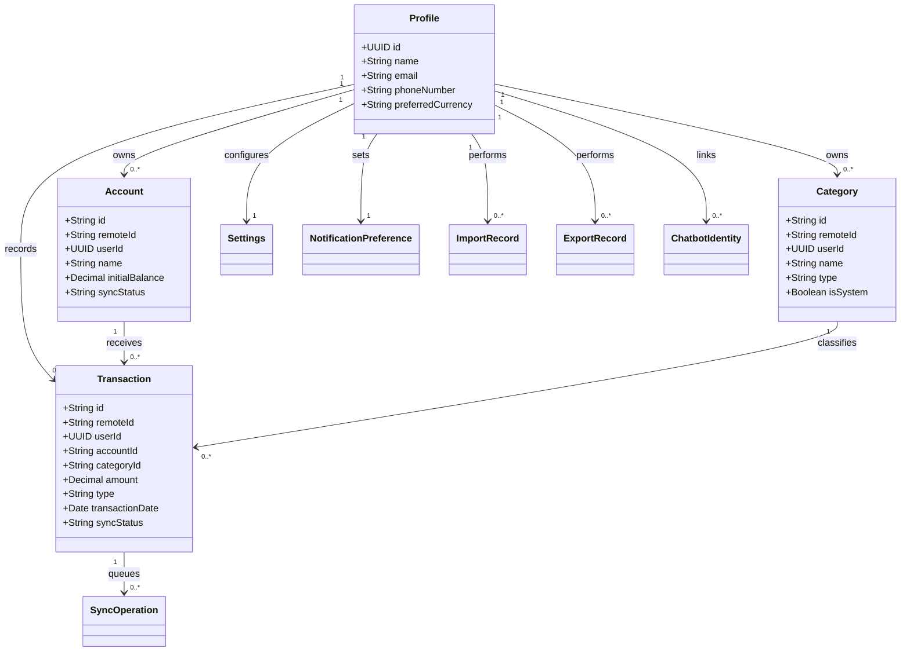

# UML Diagrams

*Monilog - Smart Financial Tracking & Analytics Tool*

## Purpose

This document collects the key UML and process diagrams used to describe Monilog behavior, structure, and interaction patterns.

## Diagram Coverage

The documentation includes:

- use case diagram
- class diagram
- sequence diagrams
- activity diagrams
- component diagram

## Diagram Asset Note

Some image exports in `docs/images/` were produced during earlier planning phases, so a few filenames still contain older wording. The textual labels and Mermaid references in this document are the current source of truth for the web application direction.

## Use Case Diagram

**Purpose:** Show the major user interactions with the system.

## Class Diagram

**Purpose:** Show the core entities and their relationships.

### Mermaid Reference

## Sequence Diagrams

### Add Transaction via Web App

**Purpose:** Show how a manual transaction is created from the web application.

### Add Transaction via WhatsApp Chatbot

**Purpose:** Show how a chatbot message becomes a stored transaction.

### View Dashboard Summary

**Purpose:** Show how dashboard metrics are generated.

### Import Data

**Purpose:** Show the file import flow.

### Export Data

**Purpose:** Show the export flow.

## Activity Diagrams

### Manual Entry Activity

**Purpose:** Show the user flow for manual web-based entry.

### Chatbot Entry Activity

**Purpose:** Show the conversational entry path for chat logging.

### Import Activity

**Purpose:** Show the validation and processing flow for imported files.

## Component Diagram

**Purpose:** Show how client, backend, and data components connect.

## Notes

- The diagrams focus on the MVP and near-MVP scope.
- The web application, chatbot, backend, analytics, and import/export flows all share the same backend core.
- The class and relationship model aligns with the ERD and database schema documentation.
